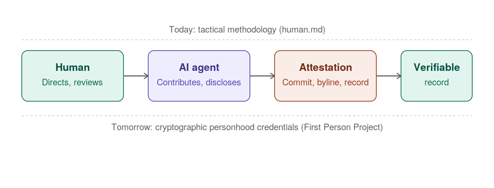
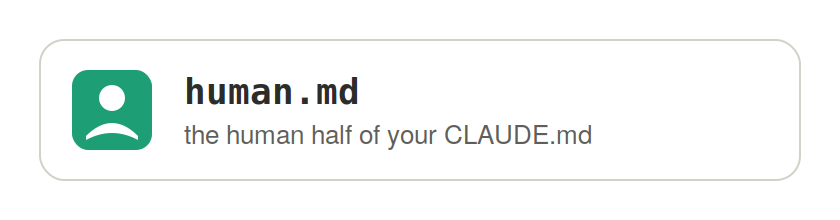

# No Ghosts in the Git Log: The Attestation Gap
### Human Accountability in the Age of Agentic Contribution

---

## 1. Premise

The regulatory boundary is not *"was a human involved?"* — it is *"is a human's involvement legally attested in the record?"*

Undocumented human consent or direction is a **compliance defect**, not a defense. An accountable human fact that exists but is absent from the instrument of record (a commit, a byline, a copyright registration) is treated by every regime examined here as functionally equivalent to no accountable human existing at all — curable, but only by correcting the record, never by pointing to an unrecorded fact after the case is challenged. (See [Appendix A: Scenario Matrix](#appendix-a) for how this plays out across the four fact patterns we've mapped.)

---

## 2. Historical Foundations

Bibliographic attribution and version-control attribution are, beneath their formatting conventions, the same instrument: a **liability ledger** dressed as a credit ledger. Both exist to answer one question when something goes wrong — *who do we hold accountable, who can testify, who can be sued, credited, or retracted* — not merely *who gets recognition*.

**Bibliography.** Remember your early education, when you were taught the process for how to add credibility to your work while also protecting against plagiarism? Authorship bylines, citation trails, and retraction notices only function because the named author is a legal person capable of being questioned, disciplined, or held liable. A retraction requires an accountable author to respond. A plagiarism finding requires someone who can be sanctioned. The entire apparatus — peer review sign-off, conflict-of-interest disclosure, corresponding-author responsibility — presupposes a party capable of bearing consequences.

**Version control.** As software developers, remember the days when OSS projects held their `MAINTAINERS` file in esteem? The `git blame` command exists for the identical reason as the bibliography process: to answer, after the fact, *who wrote this line, and who do we ask/hold responsible*. It is used in real disputes — license compliance audits, CLA enforcement, security incident postmortems, insider-threat investigations — precisely as a liability trace, not a trophy case. The Developer Certificate of Origin (`Signed-off-by`) and `Co-authored-by` trailers are the git-native equivalent of a journal's authorship attestation: a legal speech-act asserting *"a real, accountable party stands behind this contribution and certifies its origin."*

**The emerging complication: `git ai` / agent-attribution tooling.** As AI coding agents began generating commits directly, tooling has emerged (agent trailers, `git ai`-style provenance tags, `AGENTS.md`-style declarations) to record *that* an AI produced or assisted a change. This is necessary and good — disclosure is the correct instinct, mirroring the disclosure requirements published by regulatory and standards bodies such as [COPE](https://publicationethics.org/guidance/cope-position/authorship-and-ai-tools) and the [ICMJE](https://www.icmje.org/recommendations/browse/roles-and-responsibilities/defining-the-role-of-authors-and-contributors.html). But disclosure of AI involvement is a different act from **attestation of accountability**. A trailer that says "generated by Agent X" discloses a fact; it does not, and structurally cannot, perform the certifying function that `Signed-off-by` or a named author historically performed, because the agent has no legal capacity to bear the liability the mechanism was built to attach. The risk is that as this tooling matures, it will be visually and procedurally *indistinguishable* from authorship attribution — an AI agent name sitting in a trailer that looks exactly like a human co-author trailer — while carrying none of the legal weight. That collapse of form without substance is precisely the compliance gap this paper is naming (formalized as [Scenario 3](https://vinomaster.github.io/human.md/#scenario-3) in Appendix A).

---

## 3. Real-World Motivations

This is not a hypothetical concern; it is actively being addressed — reactively and proactively — by the same institutions that steward the open-source supply chain.

### 3.1 The accountability failure already happened: XZ Utils
In 2024, a multi-year social-engineering campaign built a fake maintainer persona ("Jia Tan") that earned commit and release privileges on a core Linux compression dependency, and came within a hair of shipping a supply-chain backdoor into most of the world's Linux distributions — caught not by process, but by one engineer's diligence. The failure was not technical sophistication; it was **an unaccountable identity holding an attestable role**. This is the human-side mirror of the AI-authorship problem: a name occupied the position where accountability is supposed to live, but no real, verifiable, accountable person was actually behind it. Whether the false party is a fabricated human persona or an AI agent credited as if it were a person, the structural defect is the same — **the record asserts an accountability that doesn't exist** (this is the failure mode [Scenario 2 in Appendix A](#scenario-2) describes as void and non-curable).

### 3.2 Institutional response, proactive side: the Agentic AI Foundation (AAIF)
In December 2025, the Linux Foundation launched the **[Agentic AI Foundation (AAIF)](https://www.linuxfoundation.org/press/linux-foundation-announces-the-formation-of-the-agentic-ai-foundation)**, with Anthropic, OpenAI, and Block as founding contributors (MCP, AGENTS.md, and goose respectively), and AWS, Google, Microsoft, Bloomberg, and Cloudflare as members. Its stated purpose is neutral, vendor-independent governance for agent interoperability and trust as agentic coding tools move from experimentation into production. This is the standards-and-plumbing layer: it establishes *how* agents communicate and declare context (`AGENTS.md`), but does not by itself resolve *who is legally accountable* when an agent's contribution ships. Scale context: GitHub reports 1M+ agent-authored pull requests via Copilot's coding agent alone within five months of release, and OpenAI reports Codex has been used to help merge over 2 million public pull requests — agentic contribution is no longer edge-case volume, it is mainstream throughput.

### 3.3 Institutional response, identity side: the First Person Project (FPP)
Directly motivated by the XZ Utils near-miss, the **[First Person Project](https://www.firstperson.network/white-paper)** is currently an emerging, in-formation community initiative backed by Linux Foundation Decentralized Trust, the Ayra Association, Trust Over IP, the Decentralized Identity Foundation, and the OpenWallet Foundation. It is chartered to build **personhood credentials** (cryptographic attestation that a contributor is a real, unique human) and **verifiable relationship credentials** (attestations of who a party works for or represents), issued and held in personal digital wallets, privacy-preserving by design (no central biometric database). Linux Foundation leadership has explicitly named the second, forward-looking motivation alongside the XZ Utils case: as AI-generated code enters the supply chain at scale, open-source SBOMs and provenance records need a mechanism to certify **which accountable human stands behind an AI agent's contribution** — a proposed "First Person Certified" status for agents, tied back to a verified human or organization. This is, functionally, an emerging *technical enforcement layer* for the same doctrine the [Copyright Office](https://www.copyright.gov/ai/Copyright-and-Artificial-Intelligence-Part-2-Copyrightability-Report.pdf) and [COPE](https://publicationethics.org/guidance/cope-position/authorship-and-ai-tools)/[ICMJE](https://www.icmje.org/recommendations/browse/roles-and-responsibilities/defining-the-role-of-authors-and-contributors.html) already established on paper: **contribution and accountability must be traceable to a legal person, and that traceability must live in the record, not merely in fact**.

*(Caveat for rigor: FPP is an emerging, in-formation initiative — the "First Person Cooperative" governance body is still aspirational, and the Linux Kernel pilot is described as newly underway. Cite it as motivating industry evidence of the risk and a proposed technical response, not as settled regulatory precedent, unlike the Copyright Office and COPE/ICMJE positions.)*

### 3.4 Enterprise trust and risk management pressure
Underneath the institutional layer, enterprise legal, security, and open-source-program-office (OSPO) functions are independently arriving at the same conclusion from a risk-management angle rather than a governance angle:

- **License and IP risk:** if AI-generated contributions cannot be cleanly attributed to an accountable human, downstream license compliance (CLA validity, provenance for SBOMs, copyright chain-of-title for commercial redistribution) becomes unauditable.
- **Security/insider-risk parallel to XZ:** as agent-authored PRs scale into the millions, the same fake-identity attack surface that produced Jia Tan now has a lower-cost, higher-volume vector — an unaccountable or under-verified agent identity merged at scale, rather than a single human infiltrator.
- **Regulatory spillover:** enterprises operating in regulated sectors (finance, healthcare, critical infrastructure) that already must satisfy human-accountability requirements analogous to COPE/ICMJE or Copyright Office doctrine in their own domains are beginning to impose equivalent internal policy on code provenance — effectively importing the academic-publishing/copyright standard into software engineering governance by risk-committee mandate, ahead of any binding law requiring it. How? Some recognize that no single company can solve this alone and are actively convening and/or participating in open standards initiatives (as in 3.2 and 3.3). Others are introducing internal policies based on EOL/EOS and SBOM trust-score heuristics in their software supply chain observability tools. While not a full solution, both are effectively reacting to the regulatory-compliance need to mitigate against the vulnerabilities named above.

---

## 4. Situation / Complication / Implication

So for many, this is not new news. Yet as producers and consumers of information and open-source software, we need a tactical approach to how we convey and assess accountability and trust.

**Situation:** Authorship and version-control attribution have always been the mechanism by which we assign accountability, ownership, and traceable responsibility for a piece of intellectual work — historically that mechanism assumed the named party could bear legal and professional consequences, and both academic publishing and copyright law, along with open-source provenance and maintainer trust, were built on that assumption.

**Complication:** Generative AI agents now routinely produce or co-produce content — text, research contributions, and code commits — at a volume and speed (millions of agent-authored pull requests industry-wide) that make it look attributable by format, but the agents themselves have no legal personhood, cannot hold copyright, and cannot be held accountable. Worse, human involvement can be real but undocumented (a curable but real compliance defect, structurally equivalent to ghost authorship — [Scenario 3 in Appendix A](#scenario-3)), or entirely absent while a name is fabricated to occupy the accountable role (as in the XZ Utils incident — [Scenario 2](#scenario-2)) — in both directions, applying the old attribution mechanism without adaptation silently breaks the accountability chain the mechanism exists to preserve, at a scale the mechanism was never designed to police. Additionally, the *human-in-the-loop* response is itself challenged by AI productivity demand metrics and the realization that humans cannot be the bottleneck for such scaled agentic contribution.

> Note: Without real evidence that an accountable human has reviewed the work of one or more AI agents, this is, for many, a fundamental trust factor — it's the "consented but unattested" gap named as [Scenario 3](https://vinomaster.github.io/human.md/#scenario-3) in Appendix A: real human oversight that isn't legally recoverable because it was never captured in the record.

**Implication:** Version-control and authorship policies need a new, explicit rule set — modeled on the doctrine already converged upon by copyright law and academic publishing, and increasingly enforced by emerging identity infrastructure such as the Linux Foundation's Agentic AI Foundation and First Person Project — that keeps AI's *contribution* visible and disclosed (via commit messages, agent trailers, changelogs, SBOM provenance) while reserving the *authorship/co-author/attestation* role exclusively for humans who can be verifiably identified and held legally and professionally accountable for the work.

---

## 5. Proposal / Action / Benefit

**Proposal.** Every day, papers are published and code is shipped. Contributors need a commonly acceptable way to cite where AI is — and isn't — involved: a basic methodology, simple enough that it doesn't become an inhibitor that distracts from the creative or engineering work itself. Ideally, the industry will converge on something like what the [First Person Project](https://www.firstperson.network/white-paper) is proposing — cryptographically verifiable personhood credentials that let open-source supply chains be trusted based on observability and trust scores, not on the honor system. That future is worth building toward. But it isn't here yet, and the gap identified in Sections 1–4 is accruing risk every day it stays open. Until credential-based trust infrastructure matures, we need a tactical, adoptable-today methodology — one any team can pick up without waiting for an industry standard to ratify.

**Action.** As a tactical bridge, I'd point to **[`human.md`](https://github.com/vinomaster/human.md)** — "the personhood half of your `CLAUDE.md`." Where every agentic coding tool already ships a persona file for the *agent* (`CLAUDE.md`, `.github/copilot-instructions.md`, `.cursorrules`, `.clinerules`, `.windsurfrules`, or the cross-tool `AGENTS.md`), nothing has historically defined the *human's* role, decision authority, or review commitment — a team with one job description and one undefined member. `human.md` fills that other half with a small set of markdown templates and a bootstrap script, scaffolding progressively (`solo` → `small-team` → `growing-startup` → `enterprise`) so a contributor can adopt as much rigor as their context actually requires: a `HUMAN.md` role file, an `AI-POLICY.md` attribution policy, PR/commit templates carrying attribution trailers, and — at the enterprise tier — a compliance checklist and CI attribution workflow. Its own stated premise: agent contributions lacking human attestation should be treated as lower-trust artifacts, because no accountable person has accepted responsibility for their accuracy, intent, legality, or fitness for use — which is the same premise this paper has been building from Section 1 onward.

**Benefit.** A persona-aware attribution policy earns its keep across several distinct concerns, not just one:

- **Legal clarity** during acquisitions or audits, where IP ownership and chain-of-title questions surface for the first time under scrutiny.
- **Security traceability** — tracing a vulnerability back to its origin, and to the trust level that applied to that contribution at the time it was made.
- **Compliance** — SOC 2, ISO 27001, and pre-IPO audit requirements increasingly expect a defensible account of who did what.
- **Team accountability** — knowing what was human-reviewed versus auto-generated, without relying on memory or reconstruction after the fact.
- **Code review prioritization** — directing scarce human attention where it's actually needed, rather than spreading it evenly regardless of provenance.
- **Institutional memory** — understanding how and why a codebase was built the way it was, long after the sessions (and the people) that produced it have moved on.

A well-maintained set of these documents is not a compliance exercise. It's a record of a working relationship — arguably the single most useful artifact anyone can inherit when they need to understand a codebase built by a human-agent pair. A concrete adoption checklist (the enterprise/regulated-industry tier of this practice) is provided in [Appendix B](#appendix-b), so it can sit next to the doctrine it operationalizes rather than interrupt the argument here.

---

## Appendix A: Scenario Matrix

| # | Scenario | US Copyright Office | COPE / ICMJE |
|---|---|---|---|
| 1 | Human contributes & attests | Fully copyrightable | Fully valid authorship |
| 2 | AI Agent contributes & attests, no human control/consent exists | Void, non-curable — no copyright exists | Void, non-curable — no accountable party exists ([DABUS/Thaler v. Perlmutter](https://copyright.gov/ai/docs/court-of-appeals-decision-affirming-refusal-of-registration.pdf) pattern) |
| 3 | AI Agent contributes with human consent/direction, human absent from attestation record | Defective as filed, curable via supplementary registration | Ghost authorship — curable by correcting the byline |
| 4 | Human + AI Agent(s), human is attested party of record | Copyrightable for human's discernible contribution; AI portions disclosed/disclaimed | Fully compliant — the expected norm |

*Footnote (symmetric failure mode, not separately numbered): Guest/honorary authorship — a credited human who did not actually exercise control — is the mirror-image malpractice of Scenario 3, predates AI, and is policed with equal force by both regimes.*

**Sources:** [U.S. Copyright Office, Copyright and Artificial Intelligence, Part 2: Copyrightability (Jan. 2025)](https://www.copyright.gov/ai/Copyright-and-Artificial-Intelligence-Part-2-Copyrightability-Report.pdf) · [ICMJE, Defining the Role of Authors and Contributors](https://www.icmje.org/recommendations/browse/roles-and-responsibilities/defining-the-role-of-authors-and-contributors.html) · [COPE, Authorship and AI Tools (position statement)](https://publicationethics.org/guidance/cope-position/authorship-and-ai-tools)

---

## Appendix B: Attribution Compliance Checklist

*(Enterprise / regulated-industry tier — adapted from the [`human.md`](https://github.com/vinomaster/human.md) methodology referenced in Section 5.)*

- [ ] Persona file (`CLAUDE.md`, `AGENTS.md`, etc.) defines agent persona and constraints
- [ ] `HUMAN.md` defines human role and review commitments
- [ ] `team-state.md` exists and is updated regularly
- [ ] `AI-POLICY.md` is committed to the repository root
- [ ] PR template includes a team attribution block
- [ ] Commit messages carry AI-origin trailers
- [ ] AI does not appear as git author or co-author
- [ ] Signed commits enabled (`git config --global commit.gpgsign true`)
- [ ] Session logs retained (e.g., `.claude/sessions/`) for significant features
- [ ] AI tool versions documented at the time of each release
- [ ] Calibration log reviewed before major releases
- [ ] `git-ai` or equivalent provenance tooling configured

---

## Attribution

This article was authored under a collaborative human-agent effort:

* **Collaboration-type:** Human-directed / Human-edited / Agent-researched / Agent-refined
* **AI-Agent-origins:** Claude Sonnet 5

---

